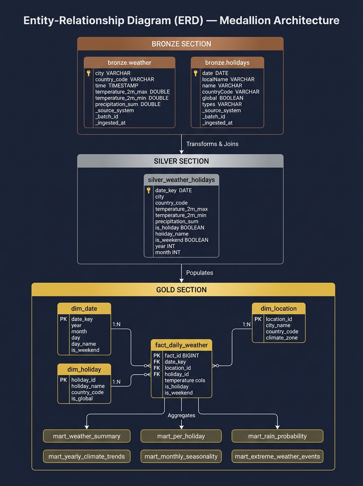

# Weather & Public Holiday Intelligence Platform


> **Architecture**: Medallion Architecture (Bronze → Silver → Gold)
> **Cities**: London (GB) & Manila (PH) · **Period**: 2021–2026 (5 years)

---

## Table of Contents

1. [Project Overview](#project-overview)
2. [Architecture](#architecture)
3. [Tech Stack](#tech-stack)
4. [Project Structure](#project-structure)
5. [Data Model](#data-model)
6. [Entity-Relationship Diagram (ERD)](#entity-relationship-diagram-erd)
7. [Data Lifecycle Management](#data-lifecycle-management)
8. [Data Quality](#data-quality)
9. [Quickstart](#quickstart)
10. [Running the Pipeline](#running-the-pipeline)
11. [Running the Dashboards](#running-the-dashboards)
12. [Observability](#observability)
13. [Dashboards](#dashboards)

---

## Project Overview

This platform answers a single analytical question:

> **Does the weather on public holidays differ from regular days — and how has that changed year over year?**

It ingests 5 years (2021–2026) of daily weather observations and national public holiday calendars for **London, UK** and **Manila, Philippines** from free, open REST APIs. The data is modelled using a **Medallion Architecture** (Bronze → Silver → Gold) with dbt, then served through two BI frontends: a Streamlit web app and a Grafana dashboard suite.

---

## Architecture

### High-Level Design (HLD)


> 🔍 **Interactive Vector Diagram**: [`docs/hld_architecture.html`](docs/hld_architecture.html)  
> Full design document with complete layer specifications: [`docs/design_documents.md`](docs/design_documents.md)

### Detailed Low-Level Design (DLD) — Pipeline Execution Flow


---

## Tech Stack

| Component | Technology | Version |
|---|---|---|
| Data warehouse | DuckDB | 1.5.5 |
| Transformation | dbt-core + dbt-duckdb | 1.9.4 / 1.11.0 |
| Web dashboard | Streamlit | 1.62.0 |
| Charts | Plotly | 6.9.0 |
| BI platform | Grafana OSS | Latest |
| MySQL bridge | mysql-mimic | 3.0.4 |
| SQL transpiler | sqlglot | 30.17.0 |
| TLS certs | cryptography | 44.0.3 |
| HTTP client | requests | 2.32.3 |
| Dataframes | pandas | 2.3.1 |
| Config | PyYAML | 6.0.2 |
| Language | Python | 3.10 / 3.11 |

---

## Project Structure

| Folder | File | Purpose |
|---|---|---|
| **`pipeline/`** | `extract_load.py` | API → Bronze Layer EL script |
| | `export_to_sqlite.py` | Export warehouse to SQLite |
| | `schema.sql` | Raw SQL schema definitions |
| **`serving/`** | `mysql_server.py` | MySQL bridge → DuckDB Gold (port 3306) |
| | `dashboard.py` | Streamlit dashboard (port 8501) |
| | `grafana_api.py` | JSON API for Grafana Infinity (port 8888) |
| **`grafana/`** | `setup_grafana_mysql.py` | Datasource + Overview dashboard |
| | `create_city_dashboards.py` | London & Manila dashboards |
| | `setup_grafana.py` | Legacy Grafana setup |
| | `setup_metabase.py` | Metabase provisioning |
| **`tests/`** | `test_city_dashboards.py` | City dashboard panel tests |
| | `test_all_panels.py` | Full panel data verification |
| | `test_panels.py` | Individual panel tests |
| | `benchmark_queries.py` | Grafana panel latency benchmark |
| **`utils/`** | `view_data.py` | Print data insights to console |
| | `inspect_db_schemas.py` | List DuckDB schemas & row counts |
| | `inspect_panels.py` | Inspect Grafana panel config |
| | `diagnose.py` | Diagnose datasource UID mismatches |
| **`config/`** | `settings.py` | YAML config loader (`cfg`, `DB_FILE`, `CITIES`) |
| | `__init__.py` | Python package marker |
| **`certs/`** | `gen_certs.py` | Generate `server.crt` & `server.key` (TLS) |
| **`docs/`** | `design_documents.md` | HLD & DLD (architecture, sequence diagrams) |
| | `erd.md` | ERD & Data Dictionary (all 3 layers) |
| | `data_lifecycle_policy.md` | Data Lifecycle Management policy |
| | `data_insights_report.md` | Key analytical findings |
| | `images/` | Generated architecture & ERD diagrams |
| **`dbt_weather_holidays/`** | `dbt_project.yml` | dbt project configuration |
| | `profiles.yml` | DuckDB connection (`../warehouse.duckdb`) |
| | `models/silver/` | `stg_weather`, `stg_holidays`, `silver_weather_holidays` |
| | `models/gold/` | `dim_*`, `fact_*`, `mart_*` |
| **Root** | `config.yaml` | Central config (cities, APIs, ports, credentials) |
| | `.env.example` | Environment variable template |
| | `.gitignore` | Git safety: excludes `.duckdb`, `.key`, `.env` |
| | `requirements.txt` | Python dependencies |
| | `LICENSE` | MIT License |

---

## Data Model

### Medallion Layers

| Layer | Schema | Materialization | Purpose |
|---|---|---|---|
| Bronze | `bronze.*` | Table | Raw immutable API data with audit lineage |
| Silver | `main_silver.*` | View / Table | Cleaned, typed, deduplicated observations |
| Gold | `main_gold.*` | Table | Star schema + pre-aggregated business marts |

### Detailed Low-Level Design (DLD)

#### Bronze Layer (`bronze.*`)
- **Purpose**: Raw, unaltered data landing zone preserving source API fidelity.
- **Tables**: `bronze.weather` (3,654 rows), `bronze.holidays` (193 rows).
- **Audit Lineage Columns**: `_ingested_at` (UTC timestamp), `_source_system` (API identifier), `_batch_id` (unique execution ID).

#### Silver Layer (`main_silver.*`)
- **Purpose**: Cleansed, standardized, conformed, and deduplicated intermediate layer.
- `stg_weather` (View): Enforces ISO date formats, validates temperature ranges, ensures precipitation ≥ 0.
- `stg_holidays` (View): Standardizes snake_case naming and types `global` as `is_global` boolean.
- `silver_weather_holidays` (Table): Joins weather and holiday observations at the daily grain with calendar flags.

#### Gold Layer (`main_gold.*`)
- **Purpose**: Highly optimized dimensional star schema and pre-computed business marts.
- **Dimensions**: `dim_date` (1,827 rows), `dim_location` (2 rows), `dim_holiday` (38 rows including surrogate `0` for "No Holiday").
- **Fact**: `fact_daily_weather` (3,654 rows) — central table linking foreign keys with numeric weather measures.
- **Business Marts**: `mart_weather_summary`, `mart_per_holiday`, `mart_yearly_climate_trends`, `mart_monthly_seasonality`, `mart_rain_probability`, `mart_extreme_weather_events`.

### Key Columns in `fact_daily_weather`

| Column | Type | Description |
|---|---|---|
| `fact_id` | BIGINT PK | Auto-generated surrogate key |
| `date_key` | DATE FK | Links to `dim_date` |
| `location_id` | INT FK | Links to `dim_location` (1=London, 2=Manila) |
| `holiday_id` | INT FK | Links to `dim_holiday` (0=Not a holiday) |
| `temperature_2m_max` | DECIMAL | Daily maximum temperature (°C) |
| `temperature_2m_min` | DECIMAL | Daily minimum temperature (°C) |
| `precipitation_sum` | DECIMAL | Daily total precipitation (mm) |
| `is_holiday` | BOOLEAN | True if the day is a public holiday |
| `is_weekend` | BOOLEAN | True if Saturday or Sunday |
| `year` / `month` | INT | Extracted calendar attributes |

---

## Entity-Relationship Diagram (ERD)



> Full ERD with data dictionary: [`docs/erd.md`](docs/erd.md)

---

## Data Lifecycle Management

> Full policy document: [`docs/data_lifecycle_policy.md`](docs/data_lifecycle_policy.md)

### Stage 1: Ingest
- **Sources**: Open-Meteo Historical Archive API, Nager.Date Public Holiday API.
- **Resilience**: Max 3 retries with exponential backoff (5s × attempt), 60s read timeout, 500ms throttle between holiday API calls.
- **Audit**: Every batch attaches `_ingested_at`, `_source_system`, and `_batch_id`.

### Stage 2: Store (Bronze)
- **Location**: DuckDB `warehouse.duckdb` under schema `bronze`.
- **Immutability**: Raw tables are written as idempotent atomic replacements. No in-place mutations.

### Stage 3: Process & Transform (Silver & Gold)
- **Tool**: `dbt-core` with `dbt-duckdb` adapter.
- **Silver**: ISO date standardization, valid range assertions, weather-holiday daily grain join.
- **Gold**: Dimensional Star Schema + 6 pre-aggregated business marts.
- **Quality Gate**: 27 automated dbt tests (run manually via `dbt test --profiles-dir .`).

### Stage 4: Serve
- **Streamlit**: Direct in-process DuckDB connection for sub-millisecond rendering.
- **Grafana**: MySQL wire protocol bridge with TLS encryption and read-only isolation.

### Stage 5: Govern & Archive
- **Retention**: Rolling 5-year active analytical horizon.
- **Archival**: Not yet automated. Manual export available via DuckDB `COPY ... TO 'file.parquet'`.
- **Refresh**: Manual — run `extract_load.py` → `dbt run` → `dbt test`. No scheduler configured.

### SLA & Quality Metrics

| Metric | Target SLA | Monitoring Method |
|---|---|---|
| Pipeline Execution Time | < 30 seconds for full ELT | Console `logging.INFO` output |
| Data Quality Test Pass Rate | 27/27 tests passing | Manual `dbt test` run |
| API Availability | Best-effort with 3 retries | Exponential backoff; failures logged to console |
| Query Latency (BI) | < 50 ms per dashboard panel | `python tests/benchmark_queries.py` (manual) |
| Data Freshness | Weekly / monthly rolling window | `_ingested_at` audit column in Bronze |

> **Note**: No external monitoring platform (Datadog, ELK, Prometheus) is integrated. All observability is console-based.

---

## Data Quality

27 automated dbt assertions run on every pipeline build:

| Test Type | Count | Models Covered |
|---|---|---|
| `unique` (PK) | 4 | dim_date, dim_location, dim_holiday, fact_daily_weather |
| `not_null` (Gold) | 9 | All dimension and fact key columns |
| `not_null` (Silver) | 9 | stg_weather, stg_holidays, silver_weather_holidays |
| `relationships` (FK) | 3 | fact_daily_weather → dim_date, dim_location, dim_holiday |
| **Total** | **27** | |

Run tests manually:

```bash
cd dbt_weather_holidays
dbt test --profiles-dir .
```

To benchmark Grafana panel query speed:

```bash
python tests/benchmark_queries.py
```

Expected: All 8 panels respond in < 20 ms each (< 100 ms total sequential).

---

## Quickstart

### 1. Prerequisites
- Python 3.10 or 3.11
- Grafana OSS installed and running on port 3000 (https://grafana.com/grafana/download)

### 2. Install dependencies

```bash
# Windows — fix execution policy first (once)
Set-ExecutionPolicy -ExecutionPolicy RemoteSigned -Scope CurrentUser

python -m venv venv
.\venv\Scripts\Activate.ps1          # Windows
# source venv/bin/activate           # macOS / Linux

pip install -r requirements.txt
```

### 3. Windows Unicode fix (run in each new session)

```powershell
$env:PYTHONIOENCODING="utf-8"
```

---

## Running the Pipeline

> [!IMPORTANT]
> DuckDB on Windows requires exclusive write access. **Stop** `serving/mysql_server.py` and `serving/dashboard.py` before running ingestion or dbt.

### Step 1 — Generate TLS Certificates (once)

```bash
python certs/gen_certs.py
```

### Step 2 — Ingest Bronze Layer data

```bash
python pipeline/extract_load.py
```

Expected: 3,654 weather rows + 193 holiday rows written to `warehouse.duckdb`.

### Step 3 — Run dbt Transformations

```bash
cd dbt_weather_holidays
dbt run --profiles-dir .
```

Expected: `PASS=13 WARN=0 ERROR=0 SKIP=0 TOTAL=13`

### Step 4 — Run dbt Data Quality Tests

```bash
dbt test --profiles-dir .
cd ..
```

Expected: `PASS=27 WARN=0 ERROR=0 SKIP=0 TOTAL=27`

---

## Running the Dashboards

Open **3 separate terminals** (all from the project root):

```bash
# Terminal 1 — MySQL bridge for Grafana (keep open)
python serving/mysql_server.py

# Terminal 2 — Streamlit web app (keep open)
streamlit run serving/dashboard.py

# Terminal 3 — Grafana provisioning (run once, then close)
python grafana/setup_grafana_mysql.py
python grafana/create_city_dashboards.py
```

### Access URLs

| Interface | URL |
|---|---|
| Streamlit Dashboard | http://localhost:8501 |
| Grafana — London | http://localhost:3000/d/weather-london-insights |
| Grafana — Manila | http://localhost:3000/d/weather-manila-insights |
| Grafana — Overview | http://localhost:3000/d/weather-holiday-mysql |

Grafana default credentials: `admin` / `admin`

---

## Observability

This project uses **console-based observability only**:

| What | How |
|---|---|
| API fetch success/failure | `logging.INFO` / `logging.ERROR` in `pipeline/extract_load.py` |
| dbt test failures | dbt prints to console + non-zero exit code |
| Query performance | `python tests/benchmark_queries.py` (manual run) |
| DuckDB schema inspection | `python utils/inspect_db_schemas.py` |
| Grafana datasource diagnosis | `python utils/diagnose.py` |

No external monitoring platform (Datadog, ELK, Grafana Loki, Prometheus) is integrated.

---

## Dashboards

### Streamlit App (port 8501)
- Dark mode with hidden Streamlit branding
- City switcher: London / Manila
- 7 insight modules:
  - KPI metrics (total days, holiday count, avg temperatures)
  - Holiday vs Regular Day temperature comparison
  - Rain probability chart
  - Year-over-Year temperature trends
  - Monthly seasonality breakdown
  - Per-holiday weather rankings table
  - Medallion architecture sidebar

### Grafana (port 3000)
- **Separate dedicated dashboards** for London and Manila
- **Overview dashboard** with comparative London vs Manila panels
- Each dashboard includes:
  - Refresh All Tiles button (HTML panel)
  - City navigation pills
  - Native Grafana timepicker with auto-refresh intervals
  - 8 data panels per city:
    1. Avg Max Temperature: Holiday vs Regular Day
    2. Year-over-Year Avg Max Temperature
    3. Monthly Temperature Seasonality (Holiday vs Regular)
    4. Top 10 Wettest Holidays (by rainfall)
    5. Per-Holiday Avg Precipitation
    6. Rain Probability (%)
    7. Holiday vs Regular Day Summary Table
    8. Per-Holiday Full Stats Table

---

## License

MIT License. See [LICENSE](LICENSE) for details.
