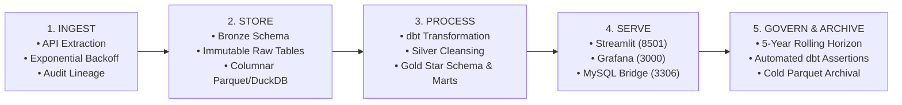

# Data Lifecycle Management (DLM) Policy

---

## 1. Overview & Policy Objective
The Data Lifecycle Management (DLM) policy governs the end-to-end lifecycle of weather and holiday data—from initial ingestion from third-party REST APIs to storage, automated processing, analytical serving, and long-term retention/archival.



---

## 2. The 5 Data Lifecycle Stages

### Stage 1: Ingest (Data Collection & Ingestion)
* **Data Sources**:
  1. Open-Meteo Historical Archive API (`https://archive-api.open-meteo.com/v1/archive`)
  2. Nager.Date Public Holiday API (`https://date.nager.at/api/v3/PublicHolidays`)
* **Ingestion Method**: Batch EL script (`extract_load.py`).
* **Resilience Policy**:
  - Max 3 retries with exponential backoff (`5s * attempt`).
  - Read timeout set to 60 seconds per request.
  - API rate-limit throttling (500ms delay between consecutive holiday API calls).
* **Audit Metadata Mandate**:
  - Every ingested batch must attach `_ingested_at` (UTC timestamp), `_source_system`, and `_batch_id`.

---

### Stage 2: Store (Raw Landing Zone / Bronze)
* **Storage Location**: DuckDB database `warehouse.duckdb` under schema `bronze`.
* **Immutability Principle**: Raw tables (`bronze.weather`, `bronze.holidays`) are written as append-capable or idempotent atomic replacements. No in-place data updates or schema mutations are permitted in Bronze.
* **Storage Format**: High-efficiency columnar storage.

---

### Stage 3: Process & Transform (Silver & Gold Layers)
* **Orchestration Tool**: `dbt-core` with `dbt-duckdb` adapter.
* **Processing Rules**:
  - **Silver Layer (`main_silver`)**:
    - Standardization: Convert all dates to standard ISO `DATE` type.
    - Cleaning: Ensure valid range assertions (`temperature_2m_max >= temperature_2m_min`, `precipitation_sum >= 0`).
    - Enrichment: Join weather observations with holiday calendars to produce `silver_weather_holidays`.
  - **Gold Layer (`main_gold`)**:
    - Modeling: Dimensional Star Schema (`dim_date`, `dim_location`, `dim_holiday`, `fact_daily_weather`).
    - Referential Integrity: Map non-holiday observations to surrogate key `holiday_id = 0`.
    - Mart Materialization: Build pre-aggregated tables (`mart_weather_summary`, `mart_per_holiday`, `mart_yearly_climate_trends`, `mart_monthly_seasonality`, `mart_rain_probability`, `mart_extreme_weather_events`).
* **Data Quality Validation (27 dbt Tests)**:
  - Run manually via `dbt test --profiles-dir .` from the `dbt_weather_holidays/` directory.
  - Tests cover: primary key uniqueness, not-null constraints, and foreign key referential integrity.
  - On failure: dbt prints a summary to the console and exits with a non-zero code.
  - **Note**: There is no automated gate or alerting. It is the operator's responsibility to review test output before running the serving layer. No email, Slack, or monitoring integration is configured.

---

### Stage 4: Serve & Analyze (Consumption Layer)
* **Service Interfaces**:
  1. **In-Process Python SQL**: Used by Streamlit (`dashboard.py`) on port 8501 for sub-millisecond dynamic rendering.
  2. **MySQL Wire Protocol**: Handled by `mysql_server.py` on port 3306 with TLS encryption for Grafana.
* **Security & Access**:
  - Encrypted in-transit communication via self-signed TLS certificates.
  - Read-only warehouse connection isolation (`read_only=True`).

---

### Stage 5: Govern, Retain & Archive
* **Active Data Retention Window**:
  - Rolling **5-year active analytical horizon** (current year $N$ down to $N-5$). The `extract_load.py` script fetches exactly 5 years of data on each run.
* **Archival Policy**:
  - **Not yet implemented.** There is no automated archival or Parquet export script. If archival is required, it would need to be done manually via DuckDB's `COPY` command:
    ```sql
    COPY (SELECT * FROM bronze.weather WHERE year < 2021)
    TO 'archive/weather_old.parquet' (FORMAT PARQUET);
    ```
* **Data Refresh Frequency**:
  - Manual refresh: run `python pipeline/extract_load.py` followed by `dbt run` and `dbt test`. No scheduler or cron job is configured.
* **Data Deletion & Purging Policy**:
  - No customer Personally Identifiable Information (PII) is stored; weather and holiday data are public domain. Data purges apply only during retention rollover.

---

## 3. SLA & Quality Metrics Matrix

| Metric | Target SLA | Actual Monitoring Method |
|---|---|---|
| **Pipeline Execution Time** | < 30 seconds for full ELT | Console `logging.INFO` output only — no timing instrumentation or dashboarding |
| **Data Quality Test Pass Rate** | 27/27 tests passing | Manual `dbt test --profiles-dir .` run; results printed to console; no automated alerting |
| **API Availability & Fallback** | Best-effort with 3 retries | Exponential backoff in `extract_load.py`; failures logged to console as `logging.ERROR`; no uptime SLA enforced |
| **Query Latency (BI)** | < 50 ms per dashboard panel | Measured via `python tests/benchmark_queries.py` (manual run); verified < 20 ms per panel |
| **Data Freshness** | Weekly / monthly rolling window | `_ingested_at` audit column stored in Bronze; no automated freshness check or alert configured |

> [!NOTE]
> No external monitoring platform (Datadog, ELK, Grafana Loki, Prometheus) is integrated into this project. All observability is currently limited to console output from Python's built-in `logging` module and manual `dbt test` execution.
