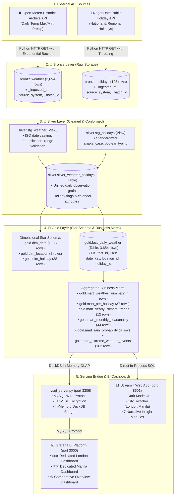
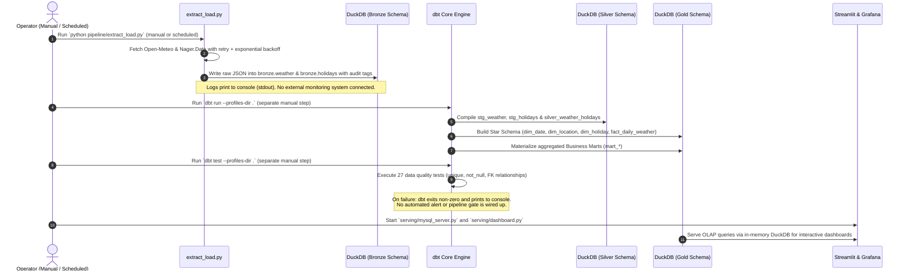

# Weather & Public Holiday Intelligence Platform
## System Architecture & Technical Design Document (HLD & DLD)

---

## 1. High-Level Design (HLD)

### 1.1 Architectural Pattern: Medallion Architecture
The platform implements a multi-tier **Medallion Architecture (Bronze $\rightarrow$ Silver $\rightarrow$ Gold)** to guarantee data quality, lineage traceability, and high-performance analytical querying across multi-city data (London & Manila, 2021–2026).

---

### 1.2 Data Lifecycle Management (DLM) Flow

---

## 2. Detailed Low-Level Design (DLD)

### 2.1 Medallion Layer Specifications

#### 🥉 Bronze Layer (`bronze.*`)
* **Purpose**: Raw, unaltered data landing zone preserving source API fidelity.
* **Tables**:
  - `bronze.weather`: 3,654 raw daily weather observations for London and Manila.
  - `bronze.holidays`: 193 public holiday records for GB and PH across 2021–2026.
* **Audit Lineage Columns**:
  - `_ingested_at` (`TIMESTAMP`): UTC ingestion timestamp.
  - `_source_system` (`VARCHAR`): `'open-meteo-archive'` or `'nager-date-api'`.
  - `_batch_id` (`VARCHAR`): Unique execution batch ID (e.g. `'20260824_182900'`).

#### 🥈 Silver Layer (`main_silver.*`)
* **Purpose**: Cleansed, standardized, conformed, and deduplicated intermediate layer.
* **Models**:
  - `stg_weather` (View): Enforces ISO date formats, validates temperature ranges (`is_valid_temp_range`), and ensures precipitation $\ge 0$.
  - `stg_holidays` (View): Standardizes snake_case naming and types `global` as `is_global` boolean.
  - `silver_weather_holidays` (Table): Joins weather and holiday observations at the daily grain, generating calendar flags (`is_weekend`, `year`, `month`).

#### 🥇 Gold Layer (`main_gold.*`)
* **Purpose**: Highly optimized dimensional star schema and pre-computed business marts ready for consumption.
* **Dimensional Model**:
  - `dim_date`: 1,827 unique calendar dates with English day names, weekend flags, and seasons.
  - `dim_location`: Surrogate location keys for London (`1`) and Manila (`2`) with climate zones.
  - `dim_holiday`: Surrogate holiday keys with a default `0` (`"No Holiday"`) record to preserve referential integrity.
  - `fact_daily_weather`: Central fact table linking foreign keys with numeric weather measures.
* **Business Marts**:
  - `mart_weather_summary`: Holiday vs. Regular Day high-level metrics.
  - `mart_per_holiday`: Holiday-by-holiday performance rankings and records.
  - `mart_yearly_climate_trends`: 5-year longitudinal temperature and rainfall trends.
  - `mart_monthly_seasonality`: 12-month seasonal benchmark controlling for calendar timing.
  - `mart_rain_probability`: Probability percentages for rainy and heavy-rain days.
  - `mart_extreme_weather_events`: Leaderboard of top single-day precipitation events on holidays.

---

### 2.2 Data Quality & Automated Testing Matrix (dbt)

27 automated schema assertions run upon every pipeline build:
* **Uniqueness**: `unique` on all primary surrogate keys (`dim_date.date_key`, `dim_location.location_id`, `dim_holiday.holiday_id`, `fact_daily_weather.fact_id`).
* **Nullability**: `not_null` assertions on all dimensions, foreign keys, and grain identifiers.
* **Referential Integrity**: `relationships` assertions validating that `fact_daily_weather` foreign keys strictly resolve to `dim_date`, `dim_location`, and `dim_holiday`.

---

### 2.3 Consumption Layer Architecture
1. **Streamlit App (`dashboard.py`)**:
   - Queries `main_gold.fact_daily_weather` directly via in-process DuckDB connection.
   - Features city switcher, dark mode styling, and 7 insight modules.
2. **Grafana BI Platform**:
   - Connects to `mysql_server.py` on port 3306.
   - Separate dedicated dashboards for London (`/d/weather-london-insights`) and Manila (`/d/weather-manila-insights`).
