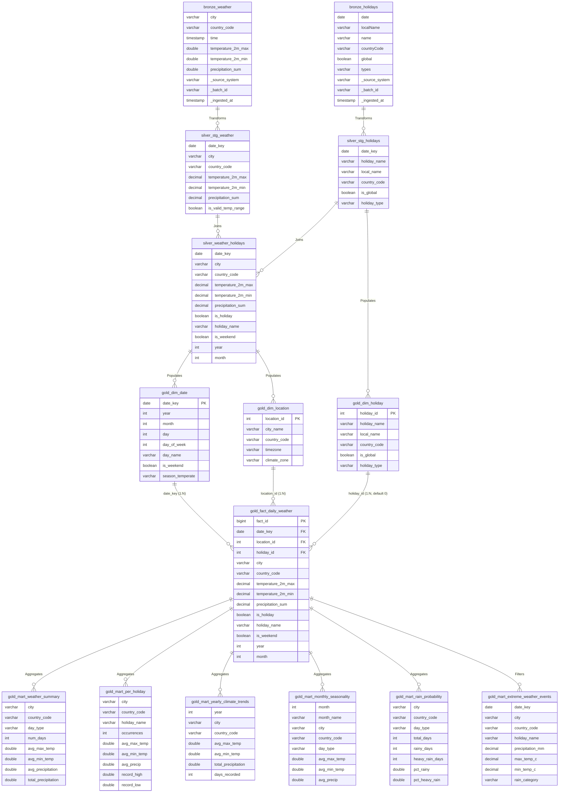

# Weather & Holiday Data Platform: Entity-Relationship Diagram (ERD) & Data Dictionary
**Architecture**: Medallion Architecture (Bronze $\rightarrow$ Silver $\rightarrow$ Gold)  

---

## 1. Medallion Entity-Relationship Diagram

---

## 2. Medallion Data Dictionary

### 2.1 🥉 Bronze Layer (`bronze`)
*Raw append-only ingestion layer with audit metadata lineage.*

| Table | Column | Type | Description |
|---|---|---|---|
| `bronze.weather` | `city` | `VARCHAR` | Standardized city name |
| | `country_code` | `VARCHAR(2)` | ISO-3166-1 alpha-2 country code |
| | `time` | `TIMESTAMP` | Raw observation date |
| | `temperature_2m_max` | `DOUBLE` | Daily maximum temperature (°C) |
| | `temperature_2m_min` | `DOUBLE` | Daily minimum temperature (°C) |
| | `precipitation_sum` | `DOUBLE` | Total daily precipitation (mm) |
| | `_source_system` | `VARCHAR` | Source identifier (`open-meteo-archive`) |
| | `_batch_id` | `VARCHAR` | Execution batch timestamp |
| | `_ingested_at` | `TIMESTAMP` | UTC ingestion timestamp |
| `bronze.holidays` | `date` | `DATE` | Holiday date |
| | `localName` | `VARCHAR` | Localized native holiday name |
| | `name` | `VARCHAR` | English holiday name |
| | `countryCode` | `VARCHAR(2)` | ISO country code |
| | `global` | `BOOLEAN` | Nationwide observation flag |
| | `types` | `VARCHAR` | Category classification |
| | `_source_system` | `VARCHAR` | Source identifier (`nager-date-api`) |
| | `_batch_id` | `VARCHAR` | Execution batch timestamp |
| | `_ingested_at` | `TIMESTAMP` | UTC ingestion timestamp |

---

### 2.2 🥈 Silver Layer (`main_silver`)
*Cleaned, conformed, and enriched models.*

| Model | Column | Type | Key | Description |
|---|---|---|---|---|
| `silver_weather_holidays` | `date_key` | `DATE` | FK | Calendar observation date |
| | `city` | `VARCHAR` | - | Monitored city name |
| | `country_code` | `VARCHAR(2)` | - | Country code (`GB`, `PH`) |
| | `temperature_2m_max` | `DECIMAL(5,2)`| - | Daily max temperature |
| | `temperature_2m_min` | `DECIMAL(5,2)`| - | Daily min temperature |
| | `precipitation_sum` | `DECIMAL(6,2)`| - | Daily precipitation sum |
| | `is_valid_temp_range` | `BOOLEAN` | - | Quality flag (`max >= min`) |
| | `is_holiday` | `BOOLEAN` | - | True if day is an official holiday |
| | `holiday_name` | `VARCHAR` | - | Name of holiday or 'Not a Holiday' |
| | `is_weekend` | `BOOLEAN` | - | True if Saturday or Sunday |
| | `year` / `month` / `day`| `INTEGER` | - | Extracted calendar components |

---

### 2.3 🥇 Gold Layer (`main_gold`)
*Dimensional star schema and consumption-ready analytical marts.*

#### Star Schema Tables:
* **`gold.dim_date`** (PK: `date_key`): 1,827 rows. Day name, day of week, weekend indicator, temperate season.
* **`gold.dim_location`** (PK: `location_id`): 2 rows (London=1, Manila=2). Timezone, climate classification.
* **`gold.dim_holiday`** (PK: `holiday_id`): 38 rows (including surrogate `0` for `"No Holiday"`).
* **`gold.fact_daily_weather`** (PK: `fact_id`, FKs: `date_key`, `location_id`, `holiday_id`): 3,654 rows.

#### Business Serving Marts:
* **`mart_weather_summary`**: High-level KPI aggregations by city and day type.
* **`mart_per_holiday`**: Individual holiday performance, occurrences, record highs/lows.
* **`mart_yearly_climate_trends`**: 5-year longitudinal trend metrics.
* **`mart_monthly_seasonality`**: 12-month calendar seasonal comparison.
* **`mart_rain_probability`**: Rain (>0mm) and heavy rain (>5mm) percentage likelihoods.
* **`mart_extreme_weather_events`**: Leaderboard of top single-day precipitation events on holidays.
